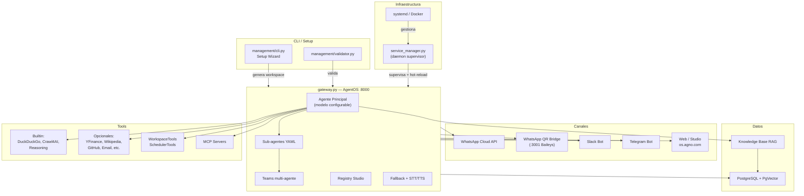

<p align="center">
  <h1 align="center">OpenAgno</h1>
  <p align="center">
    <strong>Plataforma open-source para agentes IA autonomos y multimodales</strong>
  </p>
  <p align="center">
    <a href="https://www.python.org/downloads/"></a>
    <a href="https://docs.agno.com"></a>
    <a href="LICENSE"></a>
    <a href="https://github.com/israelgo93/OpenAgno"></a>
  </p>
</p>

---

## Por que OpenAgno?

- **Workspace declarativo (YAML/Markdown)**: toda la configuracion del agente vive en archivos versionables. Configura una vez, despliega en cualquier entorno sin modificar codigo.
- **Multi-modelo con fallback automatico**: soporta Google Gemini, OpenAI, Anthropic y AWS Bedrock. Ante un rate-limit, el sistema cambia al modelo fallback y restaura el principal tras un cooldown configurable.
- **Multi-canal simultaneo**: WhatsApp (Cloud API oficial + QR via Baileys), Slack, Telegram y Web/Studio corriendo en paralelo desde una misma instancia.
- **Auto-configuracion**: el agente modifica su propio workspace en tiempo real via WorkspaceTools — crea sub-agentes, ajusta instrucciones, habilita tools y solicita reload al daemon.
- **Knowledge Base RAG con PgVector**: busqueda hibrida (semantica + full-text), auto-ingesta de documentos y URLs al arrancar, embeddings via OpenAI.
- **Studio visual y MCP server integrado**: conecta desde [os.agno.com](https://os.agno.com) para gestionar agentes, teams, sesiones y memorias. Expone MCP server para integracion con IDEs y clientes externos.

---

## Quick Start

```bash
# 1. Clonar el repositorio
git clone https://github.com/israelgo93/OpenAgno.git
cd OpenAgno

# 2. Instalar dependencias (crea venv + instala requirements)
bash setup.sh

# 3. Ejecutar el wizard de configuracion
python -m management.cli

# 4. Validar el workspace generado
python -m management.validator

# 5. Iniciar el gateway
python gateway.py
```

El agente estara disponible en `http://localhost:8000`.
Conecta Studio desde [os.agno.com](https://os.agno.com) > Add OS > Local.

---

## Arquitectura



---

## Workspace

El workspace es el directorio declarativo que define completamente al agente. Todos los archivos son versionables y portables.

| Archivo | Funcion |
|---------|---------|
| `workspace/config.yaml` | Configuracion central: modelo, DB, canales, memoria, audio |
| `workspace/instructions.md` | Personalidad, reglas y capacidades del agente |
| `workspace/tools.yaml` | Herramientas habilitadas (builtin + opcionales) |
| `workspace/mcp.yaml` | Servidores MCP externos |
| `workspace/self_knowledge.md` | Auto-consciencia: providers, tools y canales validos |
| `workspace/knowledge/docs/` | Documentos para RAG (PDF, TXT, MD, CSV, DOCX, JSON) |
| `workspace/knowledge/urls.yaml` | URLs para auto-ingesta |
| `workspace/agents/*.yaml` | Definiciones de sub-agentes |
| `workspace/agents/teams.yaml` | Equipos multi-agente con modos de coordinacion |
| `workspace/schedules.yaml` | Tareas cron programadas |
| `workspace/integrations/` | Integraciones declarativas con env propio |

### Ejemplo config.yaml

```yaml
agent:
	name: AgnoBot
	id: agnobot-main
	description: Asistente personal multimodal

model:
	provider: google
	id: gemini-2.5-flash
	fallback:
		provider: aws_bedrock_claude
		id: us.anthropic.claude-sonnet-4-6

database:
	type: supabase

channels:
	- whatsapp
	- telegram

whatsapp:
	mode: cloud_api

memory:
	enable_agentic_memory: true
	num_history_runs: 5
```

---

## Modelos soportados

| Provider | Modelos | API Key requerida |
|----------|---------|-------------------|
| `google` | `gemini-2.5-flash` (default), `gemini-2.5-pro` | `GOOGLE_API_KEY` |
| `openai` | `gpt-4.1`, `gpt-4o`, `gpt-4o-mini` | `OPENAI_API_KEY` |
| `anthropic` | `claude-sonnet-4`, `claude-opus-4` | `ANTHROPIC_API_KEY` |
| `aws_bedrock_claude` | `us.anthropic.claude-sonnet-4-6`, `us.anthropic.claude-opus-4-6-v1` | `AWS_ACCESS_KEY_ID` + `AWS_SECRET_ACCESS_KEY` |
| `aws_bedrock` | `amazon.nova-pro-v1:0` | `AWS_ACCESS_KEY_ID` + `AWS_SECRET_ACCESS_KEY` |

Cualquier modelo puede usarse como principal o como fallback. El fallback se activa automaticamente ante rate-limit y restaura el principal tras el cooldown (`FALLBACK_COOLDOWN_SECONDS`, default 60s).

---

## Canales

### WhatsApp — Cloud API (Meta Business)

Canal oficial via Meta Business API. Requiere cuenta Business verificada.

```bash
WHATSAPP_ACCESS_TOKEN=tu_token
WHATSAPP_PHONE_NUMBER_ID=tu_phone_id
WHATSAPP_VERIFY_TOKEN=tu_verify_token
WHATSAPP_APP_SECRET=tu_app_secret # Requerido en Produccion
```

Configura el webhook de Meta apuntando a `https://tu-dominio/whatsapp/webhook`.

### WhatsApp — QR Link (Baileys bridge)

Vinculacion via QR como dispositivo secundario. No requiere cuenta Business.
Usa Baileys `6.17.16` (ultima version estable; versiones `6.7.x` presentan error 405 Connection Failure).

```yaml
# workspace/config.yaml
whatsapp:
	mode: qr_link
	qr_link:
		bridge_url: http://localhost:3001
```

```bash
# 1. Iniciar bridge (Node.js o Docker)
cd bridges/whatsapp-qr && npm install && node index.js
# O con Docker: docker compose --profile qr up -d whatsapp-bridge

# 2. Iniciar gateway
python gateway.py

# 3. Escanear QR desde el navegador
# Directo desde el bridge:
open http://localhost:3001/qr/image
# Desde el gateway (pagina HTML con auto-recarga):
open http://localhost:8000/whatsapp-qr/code
```

**Nota**: El CLI automatiza estos pasos durante el setup. Al seleccionar modo QR, instala dependencias, arranca el bridge y muestra el QR para vincular.

### WhatsApp — Modo Dual

Ejecuta ambos modos en simultaneo. Configura `whatsapp.mode: dual` en `config.yaml`.

### Slack

Canal via Slack Bot. Scopes requeridos: `chat:write`, `app_mentions:read`, `im:history`, `im:read`, `im:write`.

```bash
SLACK_TOKEN=xoxb-tu-token
SLACK_SIGNING_SECRET=tu_signing_secret
```

### Telegram

Canal via Telegram Bot. Crea el bot con @BotFather y configura el token.

```bash
TELEGRAM_TOKEN=tu_token_de_botfather
```

### Web (Studio)

Siempre disponible. Conecta desde [os.agno.com](https://os.agno.com) > Add OS > Local > `http://localhost:8000`.

---

## Tools disponibles

### Builtin (siempre activos)

| Tool | Descripcion |
|------|-------------|
| `duckduckgo` | Busqueda web |
| `crawl4ai` | Scraping y extraccion de contenido web |
| `reasoning` | Razonamiento paso a paso |

### Opcionales (activar en tools.yaml)

| Tool | Descripcion | Requisitos |
|------|-------------|------------|
| `workspace` | Auto-configuracion del workspace via CRUD | Ninguno |
| `scheduler_mgmt` | Gestion de tareas cron via API REST | Ninguno |
| `yfinance` | Datos financieros en tiempo real | `pip install yfinance` |
| `wikipedia` | Busqueda en Wikipedia | `pip install wikipedia` |
| `arxiv` | Papers academicos | `pip install arxiv` |
| `calculator` | Calculadora matematica | Ninguno |
| `github` | Operaciones en repositorios GitHub | `pip install PyGithub` + `GITHUB_TOKEN` |
| `email` | Envio de correos via Gmail | `GMAIL_SENDER`, `GMAIL_PASSKEY`, `GMAIL_RECEIVER` |
| `tavily` | Busqueda web avanzada (MCP) | `TAVILY_API_KEY` |
| `audio` | STT (Whisper) + TTS (OpenAI) | `OPENAI_API_KEY` |
| `file_tools` | Lectura/escritura de archivos | Ninguno |
| `python_tools` | Ejecucion de codigo Python | Ninguno (riesgo de seguridad) |
| `shell` | Comandos del sistema | `OPENAGNO_ROOT` (riesgo de seguridad) |
| `spotify` | Control de Spotify | Spotify API |

---

## CLI

Todos los comandos disponibles via `python -m management.cli`:

| Comando | Descripcion |
|---------|-------------|
| *(sin argumentos)* | Setup wizard: genera workspace/, .env y sub-agentes desde cero |
| `chat` | Chat interactivo con el agente desde la terminal |
| `doctor` | Diagnostica problemas del workspace y ofrece reparacion automatica |
| `configure` | Reconfigura una seccion especifica (modelo, DB, canales, tools, identidad, audio) |
| `fallback` | Configura el modelo fallback de respaldo |
| `audio` | Configura transcripcion automatica (STT) y sintesis de voz (TTS) |
| `status` | Muestra estado del sistema: gateway, bridge QR, modelo activo |
| `help` | Muestra la ayuda con todos los comandos |

```bash
python -m management.cli              # Setup wizard
python -m management.cli chat         # Chat interactivo
python -m management.cli doctor       # Diagnostico
python -m management.cli configure    # Reconfiguracion
python -m management.cli fallback     # Modelo fallback
python -m management.cli audio        # Audio STT/TTS
python -m management.cli status       # Estado del sistema
```

---

## Studio + AgentOSClient

### Conectar Studio

1. Iniciar el gateway: `python gateway.py`
2. Abrir [os.agno.com](https://os.agno.com) > Add OS > Local
3. Ingresar `http://localhost:8000`

Studio muestra todos los agentes, sub-agentes, teams y tools registrados en el Registry.

### AgentOSClient (Python)

```python
from agno.os.client import AgentOSClient

client = AgentOSClient(base_url="http://localhost:8000")

# Configuracion del OS
config = await client.aget_config()

# Listar agentes registrados
agents = client.get_agents()

# Ejecutar un agente
response = await client.run_agent(
	agent_id="agnobot-main",
	message="Hola, que puedes hacer?",
)

# Consultar sesiones y memorias de un usuario
sessions = client.get_sessions(user_id="user123")
memories = client.get_memories(user_id="user123")
```

---

## API Endpoints

| Metodo | Ruta | Descripcion |
|--------|------|-------------|
| `GET` | `/admin/health` | Health check: agentes, teams, canales, modelo, fallback |
| `POST` | `/admin/reload` | Solicitar hot-reload al daemon supervisor |
| `POST` | `/admin/fallback/activate` | Activar modelo fallback manualmente |
| `POST` | `/admin/fallback/restore` | Restaurar modelo principal |
| `POST` | `/knowledge/upload` | Subir documento a Knowledge Base (PDF, TXT, MD, CSV, DOCX, JSON) |
| `POST` | `/knowledge/ingest-urls` | Ingestar lista de URLs |
| `GET` | `/knowledge/list` | Listar documentos ingestados |
| `DELETE` | `/knowledge/{doc_name}` | Eliminar documento |
| `POST` | `/knowledge/search` | Busqueda semantica en la Knowledge Base |
| `POST` | `/schedules` | Crear tarea cron |
| `GET` | `/schedules` | Listar schedules activos |
| `GET` | `/whatsapp-qr/status` | Estado de conexion del bridge QR |
| `GET` | `/whatsapp-qr/code` | Pagina HTML con QR para escanear (auto-recarga) |
| `GET` | `/whatsapp-qr/code/json` | QR como JSON (integraciones programaticas) |
| `POST` | `/whatsapp-qr/incoming` | Recibe mensajes del bridge QR y responde via agente |
| `POST` | `/whatsapp/webhook` | Webhook receptor de WhatsApp (Meta Cloud API) |

---

## Seguridad

### API Key

Los endpoints de Knowledge y admin se protegen con API Key via header `X-API-Key`.

```bash
# Generar key
openssl rand -hex 32

# Configurar en .env
OPENAGNO_API_KEY=tu_key_generada
```

Sin `OPENAGNO_API_KEY` configurada, el acceso es libre (modo desarrollo).

### SQL Injection Prevention

Los endpoints de Knowledge usan una whitelist de tablas permitidas (`agnobot_knowledge_contents`, `agnobot_knowledge_vectors`). Cualquier consulta que referencie tablas fuera de la whitelist es rechazada.

---

## Deploy

### systemd (recomendado para produccion)

```bash
# Instalacion automatica (genera unit file adaptado a la ruta actual)
sudo bash deploy/install-service.sh

# Comandos de gestion
sudo systemctl start openagno
sudo systemctl stop openagno
sudo systemctl restart openagno
sudo systemctl status openagno
journalctl -u openagno -f
```

### Docker Compose

```bash
# Solo base de datos PostgreSQL + PgVector
docker compose up -d db

# Gateway + base de datos
docker compose up -d

# Con WhatsApp QR bridge
docker compose --profile qr up -d
```

### service_manager.py (daemon supervisor)

Supervisa el gateway, detecta senales de reload del agente y reinicia automaticamente ante fallos.

```bash
python service_manager.py start      # Inicia daemon + gateway
python service_manager.py stop       # Detiene el proceso
python service_manager.py restart    # Reinicia gateway
python service_manager.py status     # Health check + info
```

---

## Estructura del proyecto

```
OpenAgno/
	gateway.py                  # Gateway principal: AgentOS, canales, fallback, admin
	loader.py                   # Carga dinamica del workspace y construccion de objetos Agno
	security.py                 # API Key auth para endpoints REST
	service_manager.py          # Daemon supervisor con hot-reload
	setup.sh                    # Script de instalacion (venv + dependencias)
	tools/
		workspace_tools.py      # CRUD de workspace (auto-configuracion)
		scheduler_tools.py      # Gestion de crons via API REST
		audio_tools.py          # STT (Whisper) + TTS (OpenAI)
	workspace/
		config.yaml             # Configuracion central
		instructions.md         # Personalidad del agente
		tools.yaml              # Tools habilitados
		mcp.yaml                # Servidores MCP
		self_knowledge.md       # Auto-consciencia del agente
		knowledge/docs/         # Documentos RAG
		knowledge/urls.yaml     # URLs para auto-ingesta
		agents/                 # Sub-agentes y Teams
		schedules.yaml          # Tareas cron
		integrations/           # Integraciones declarativas
	routes/
		knowledge_routes.py     # Endpoints Knowledge Base
	management/
		cli.py                  # Wizard, doctor, configure, fallback, chat, audio, status
		validator.py            # Validacion del workspace
		admin.py                # Admin via AgentOSClient
	bridges/
		whatsapp-qr/
			index.js            # Bridge Baileys (Node.js)
			package.json        # Dependencias npm
			Dockerfile          # Imagen Docker del bridge
	tests/
		conftest.py             # Fixtures
		test_loader.py          # Tests de carga
		test_validator.py       # Tests de validacion
		test_security.py        # Tests de seguridad
		test_workspace_tools.py # Tests de WorkspaceTools
	deploy/
		openagno.service        # Unit systemd
		install-service.sh      # Instalador automatico del servicio
	docker-compose.yml          # DB + gateway + bridge (profile qr)
	requirements.txt            # Dependencias produccion
	requirements-dev.txt        # Dependencias desarrollo (pytest)
	.env.example                # Template de variables de entorno
```

---

## Documentacion de referencia

| Recurso | Enlace |
|---------|--------|
| Agno Framework | [docs.agno.com](https://docs.agno.com) |
| Teams | [Building Teams](https://docs.agno.com/teams/building-teams) |
| PgVector | [Vector Stores](https://docs.agno.com/knowledge/vector-stores/pgvector/overview) |
| MCP Tools | [MCP Overview](https://docs.agno.com/tools/mcp/overview) |
| WhatsApp | [WhatsApp Interface](https://docs.agno.com/agent-os/interfaces/whatsapp/introduction) |
| Slack | [Slack Interface](https://docs.agno.com/agent-os/interfaces/slack/introduction) |
| AgentOS | [Demo](https://docs.agno.com/examples/agent-os/demo) |
| Scheduler | [Scheduler](https://docs.agno.com/agent-os/scheduler/overview) |
| Registry | [Studio Registry](https://docs.agno.com/agent-os/studio/registry) |
| AWS Bedrock | [Bedrock Claude](https://docs.agno.com/models/providers/cloud/aws-claude/overview) |

---

## Licencia

Este proyecto esta licenciado bajo [Apache License 2.0](LICENSE).
