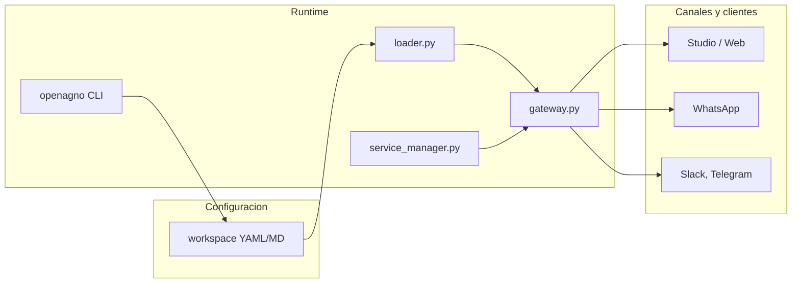

## Componentes

| Componente | Rol |
|------------|-----|
| `openagno/` | CLI empaquetada, templates y helpers para operar el proyecto |
| `management/cli.py` | Onboarding y utilidades legacy de consola |
| `management/validator.py` | Validacion del workspace antes y durante el arranque |
| `gateway.py` | FastAPI + AgentOS: agente principal, canales, admin, fallback |
| `loader.py` | Carga YAML/MD del workspace y construye agentes, DB, knowledge, MCP |
| `service_manager.py` | Supervisor opcional con hot-reload |
| `routes/knowledge_routes.py` | Endpoints REST custom para knowledge |
| `security.py` | Verificacion de API key para rutas custom que la usan |

## Flujo de arranque

1. El runtime lee `workspace/config.yaml`, `instructions.md`, `tools.yaml`, `mcp.yaml`, `self_knowledge.md`, agentes, teams, schedules e integraciones.
2. `loader.py` construye modelo principal, fallback opcional, DB, knowledge, tools y servidores MCP.
3. `gateway.py` monta el app FastAPI, registra rutas custom, aplica rate limiting y configura interfaces AgentOS.
4. AgentOS expone rutas nativas para agentes, teams, sesiones, memorias, schedules, registry y OpenAPI.

## Comportamientos relevantes en runtime

### Historial y compatibilidad de modelos

- Antes de cada run, OpenAgno sanea historial de sesion para providers que son sensibles a `tool_call_id` inconsistentes.
- Este saneamiento evita errores al reutilizar sesiones entre proveedores compatibles e incompatibles con ciertos formatos de tool call.

### WhatsApp Cloud API

- La ruta `POST /whatsapp/webhook` valida firma con `WHATSAPP_APP_SECRET`.
- Solo despues de pasar esa validacion se aplica deduplicacion por `message_id`.
- Si el payload contiene mensajes repetidos y nuevos, OpenAgno filtra los repetidos y re-firma el body antes de entregarlo al router oficial de Agno.

### Knowledge

- Si la base es SQLite, la knowledge vectorial se desactiva.
- Si la base es PostgreSQL/PgVector, se crea knowledge con el `search_type`, embedder y `max_results` definidos en `config.yaml`.
- Los documentos y URLs pueden ingerirse al arranque y tambien via API.

### Operacion

- `service_manager.py` vigila el health check y reinicia el gateway si cae o si detecta `.reload_requested`.
- Los endpoints custom de admin y knowledge tienen rate limiting.
- Si usas `openagno start` o `service_manager.py start`, los logs del gateway se escriben en `gateway.log`.

## Diagrama (resumen)

Para la estructura de archivos y rutas de edicion, ve [Estructura del proyecto](/structure).
