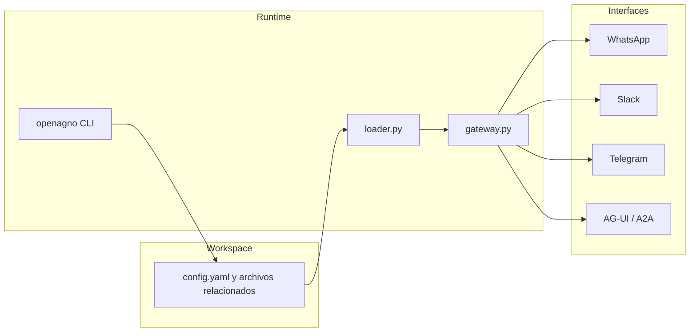

## Componentes principales

| Componente | Rol |
|------------|-----|
| `openagno/` | CLI y templates empaquetados |
| `workspace/` | Configuración declarativa del agente |
| `loader.py` | Construcción de modelo, DB, knowledge, tools y MCP |
| `gateway.py` | Runtime FastAPI + AgentOS |
| `routes/knowledge_routes.py` | API custom de knowledge |
| `tools/` | Tools locales del runtime |

## Flujo de arranque

1. `openagno` valida y lee `workspace/`.
2. `loader.py` construye modelo principal, fallback, DB, knowledge, tools, MCP, sub-agentes y teams.
3. `gateway.py` monta el app FastAPI, agrega middlewares y registra interfaces de Agno.
4. AgentOS expone el runtime y sus rutas nativas.

## Capacidades operativas relevantes

### Historial cross-model

OpenAgno sanea historial de sesión antes de ejecutar providers sensibles a `tool_call_id` incompatibles, especialmente Anthropic y Bedrock.

### WhatsApp

- valida firma si existe `WHATSAPP_APP_SECRET`
- deduplica por `message_id`
- filtra replays sin bloquear mensajes nuevos

### Knowledge

- PostgreSQL/Supabase + PgVector habilitan retrieval vectorial
- SQLite desactiva la knowledge vectorial
- documentos y URLs pueden ingerirse al arranque o vía API

### Canales y protocolos

El runtime actual soporta:

- WhatsApp
- Slack
- Telegram
- AG-UI
- A2A

## Diagrama rápido

